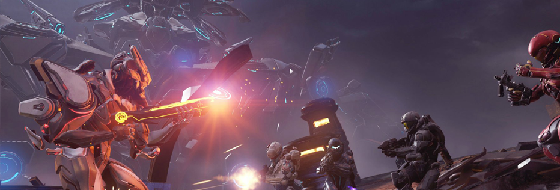
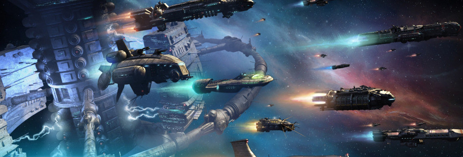
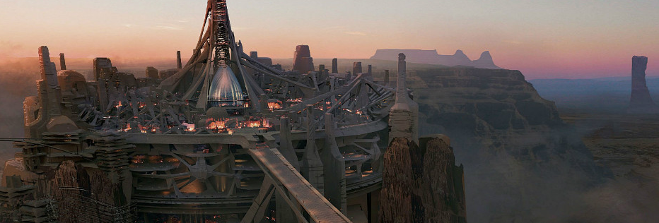

# 🪐 Eternal War Intro

## Core gameplay

1. To buy a mecha or spaceship, you can buy it in the NFT market on the official website. The official will hold events from time to time to launch a batch of blind boxes with drawings. Spaceships of different levels will appear randomly. Those who want to try their luck will remember pay attention to.
2. Configure the attributes of your own spacecraft, buy weapons or armors to increase the attack and defense attributes of the mecha or spacecraft, because most of the high-quality mineral resources are in the outer planets, and if you go to the outer planets to collect, you may be attacked.
3. Explore the universe and build relationships with other players.
4. Teaming up with other players to collect spar or looting spar from other teams is an effective way to get rich quickly.
5. Occupy the planet and build the infrastructure. You can charge a certain fee for the players who come to collect on your planet, no matter which country he belongs to.

### Battle and occupation

You can form a team with other players to complete the missions of collecting spar, attacking other players to plunder spar, or attacking other planets. You can also occupy the planet to build your own territory.

### Construction and land

In addition to collecting, players can occupy, buy, and sell NFTs of stars and land, allowing players to own a part of The Eternal War meta-universe. The owner of the NFT can pledge it to the platform's central contract to build factories and commerce on it. Property, etc. to obtain more considerable income.

### Explore and collect

Outside of the country's sphere of influence, there is endless space worth exploring for players. There are stars all over there. Although they are dangerous and remote, they are also full of opportunities. The rich minerals above are worth digging, and these unowned lands are also worth occupying and building their own country.

Welcome to the company wiki! Here you'll find everything you need to know about the company.
