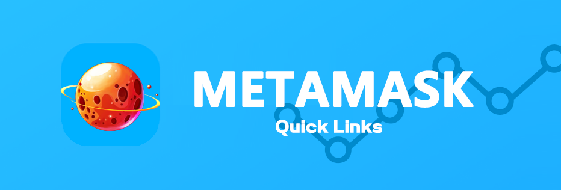

# How to participate in the game ？

You've made a wallet and gotten your BNB tokens, now you just need to connect your wallet with The Eternal War and you're good to go!

Check out the steps below for how to connect each of our recommended wallets to The Eternal War.

## Smartphone/Mobile

To connect MetaMask to The Eternal War follow the steps below.



 (1).png>)

To connect MetaMask to PancakeSwap follow the steps below.

## Android and iOS

1.Open MetaMask and tap on the **burger icon** in the top-left.

 (1).png>)

2.Tap **Settings** in the menu.

3.In the Settings menu, tap on **Network**.

.png>)

4.Tap on the **Add Network** button at the bottom.

 (1).png>)&#x20;

5.On the page that opens, type in the following details:

**Network Name:** Binance Smart Chain

**RPC Url:** [**https://bsc-dataseed.binance.org/**](https://bsc-dataseed.binance.org)****

**Chain ID:** 56

**Symbol:** BNB

**Block Explorer URL:** [**https://bscscan.com/**](https://bscscan.com)****

6.Once you've confirmed entry of the new network, go back to the burger menu and tap **Browser**.

 (1).png>)

7.Type "PancakeSwap" into the search field and start the search. The top result will be the PancakeSwap exchange. Tap to enter it.

8.You wallet will ask you to connect. Tap **Connect** to connect to The Eternal War.



## &#x20; Resources

[Download Metamask](https://metamask.io/download.html)（Automatically detects device）

[Metamask Setup Guide](https://academy.binance.com/en/articles/connecting-metamask-to-binance-smart-chain\))



 (1).png>)

To connect Trust Wallet follow the steps below. Note that Android and iOS devices do not use the same steps!

## Android

1.Open Trust Wallet and tap the **DApps** button on the bottom of the screen.

.png>)

2.Scroll down to "Popular" and tap on "The Eternal War". You can also find it in "Exchanges".



3.The Eternal War will open up. If you see a **Connect** button in the top-right tap that and tap **Trust Wallet** from the list.


If you find you are unable to connect at step 4, go back to the DApps menu and find "The Eternal War" again. Using "The Eternal War" from the "History" section may result in the same problem.


## IOS


At present, due to the official optimization of the IOS version of Trust Wallet, it is not possible to use ios to access The Eternal War.


[Download Trust Wallet](https://trustwallet.com)（Automatically detects device）

[Trust Wallet Setup Guide](https://www.binance.com/en/blog/ecosystem/how-to-set-up-and-use-trust-wallet-for-binance-smart-chain-421499824684901157)



## **Desktop/Web Browser wallets**



 (1).png>)

## Chrome and Firefox

**1.**Open MetaMask and click on the **network selector** at the top. By default it will show "Ethereum Mainnet". Scroll down and click **Custom RPC**.

.png>)

2.A window will open. Type in the details below.

**Network Name:** Binance Smart Chain

**RPC Url:** [**https://bsc-dataseed.binance.org/**](https://bsc-dataseed.binance.org)****

**Chain ID:** 56

**Symbol:** BNB

**Block Explorer URL:** [**https://bscscan.com/**](https://bscscan.com)****

****.png>)****

**3.**Make sure you've typed everything in correctly and click **Save**. Binance Smart Chain will now be one of your network options.

.png>)

4.Visit the [The Eternal WarIn ](https://www.eternalwar.io/#/)the top right corner you'll see the **Connect** button. Click it.

5.A window will appear asking you to choose a wallet to connect to. Click **MetaMask** (it's the top option on the list).

## Resources

[Download Metamask](https://metamask.io/download.html) (Automatically detects browser)

[Metamask Setup Guid](https://academy.binance.com/en/articles/connecting-metamask-to-binance-smart-chain)



.png>)

## Chrome and Firefox

1.Open Binance Chain Wallet and click on the network selector at the top. The default network will be Binance Chain. Choose **Binance Smart Chain** from the list.

.png>)

2.Visit the The Eternal War website. In the top-right, click **Connect**.

3.A window will appear asking you to choose a wallet to connect to. Click **Binance Chain Wallet** (it's farther down the list).

## Resources

[Download Binance Wallet](https://www.binance.org/en) (Biance WalletAutomatically detects browser)




**Remember - NEVER, under any situation, should you ever give someone your private key or recovery phrases.**

