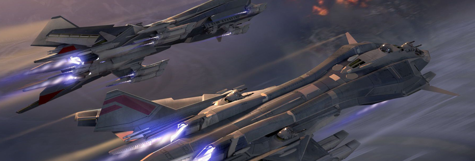

# Equipment

###

### Spaceship

You can buy it in the NFT market or get it through the blind box of the spaceship drawing.

The spacecraft contains attributes such as mining power, combat power, defense power, durability, and storage space. The attributes of the spacecraft directly determine its mining efficiency and the outcome of each battle.

Each time you perform a mission, the spacecraft will consume durability. When the durability is lower than 20%, the spacecraft will be forced to return to the base and enter the repair state. You can choose to repair automatically or use spar to accelerate repair. Different spaceships have different weapon spaces and armors. In space, you can buy weapons to increase the combat effectiveness of your spacecraft or purchase armor to increase the defense power of your spacecraft.

### Mecha

The mech is a mimic combat aircraft. It also has attributes such as mining power, combat power, defense power, durability, and storage space. Compared with the spacecraft, it has higher combat power and defense power, but due to its smaller size, it has durability, Storage space and mining power will be lower, and his attributes directly determine its mining efficiency and the outcome of each battle.

Each time you perform a task, the mecha will consume durability. When the durability is lower than 20%, the mecha will be forced to return to the base and enter the repair state. You can choose to repair automatically or use spar to accelerate the repair. Different mechas have different weapons. Space and armored space, you can buy weapons to increase the combat effectiveness of your mecha or purchase armor to increase the defense of your spaceship.

### Mining machinery

Mining machinery is a separate equipment for collecting spar.

You first need to own a spaceship and then buy it to purchase it. Its mining efficiency has nothing to do with the spacecraft’s mining power, and it will not occupy your spacecraft’s storage space. Each spacecraft can only carry a certain amount of mining machinery, the spacecraft’s The higher the mining power, the more machinery that can be carried, and the higher the level of machinery that can be carried, the smaller the number of machinery that can be carried.

There are five levels of mining machinery. The higher the level, the higher the efficiency of collecting spar.

### Armor

Each spaceship has its own armor value. It allows you to reduce damage during the battle. Purchasing armor will increase your armor value. The armor is divided into five levels. The effects of different levels of armor are as follows: The space occupied will also be different.

Armor includes two attributes: defense value and energy value. Each battle will damage the armor energy value to different degrees according to the attack power of the opponent's spacecraft, but it will not weaken its protection value. When the armor energy value returns to zero, the armor The space is automatically emptied, and you need to re-purchase armor to increase your defense value.

### Arms

Purchasing weapons can increase the attack value of the spacecraft. Weapons are divided into five levels. The higher the level, the higher the attack value and the larger the space occupied. The attack value of multiple weapons can be superimposed.

Each battle will consume the number of weapons according to the defense value of the enemy's spacecraft. The higher the enemy's defense value, the more weapons will be consumed. The minimum number of weapons consumed in each battle is 1. If the spaceship is equipped with weapons of different levels, the lowest The level of weapons starts to be consumed.
