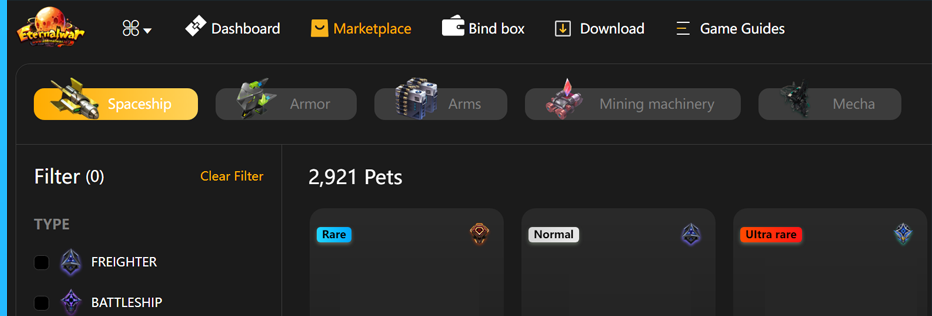

# Identity Avatar

The role is the avatar of players in the game, and players can modify them. Role avatars has specific specifications and formats with a set of default animations, such as walking, running, jumping, and fighting. This avatar will be modified by a block (helmet, arm, torso, leg, etc.), by giving it different compatible coins.
