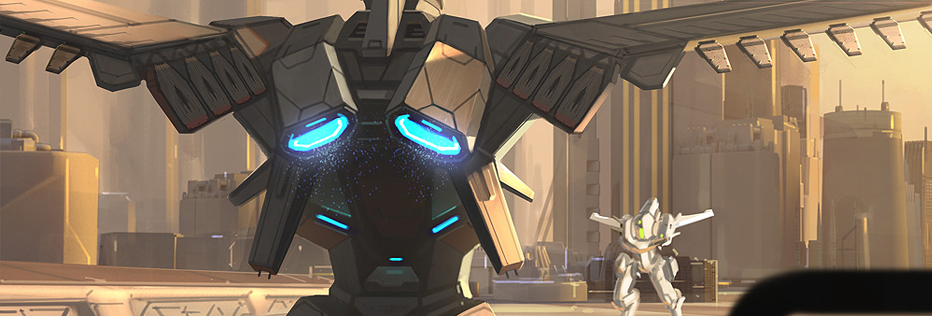

# 🦾 Mecha

The mech is a mimic combat aircraft. It also has attributes such as mining power, combat power, defense power, durability, and storage space. Compared with the spacecraft, it has higher combat power and defense power, but due to its smaller size, it has durability, Storage space and mining power will be lower, and his attributes directly determine its mining efficiency and the outcome of each battle.

Each time you perform a task, the mecha will consume durability. When the durability is lower than 20%, the mecha will be forced to return to the base to enter the repair state. You can choose to repair it automatically or use spar to speed up the repair.

Different mechas have different weapon spaces and armor spaces. You can buy weapons to increase the combat effectiveness of your mecha or purchase armor to increase the defense of your spacecraft.

## Ship class

The spacecraft is divided into five levels according to different body types and uses.

Contains seven attributes of mining durability, mining power, attack power, protection power, storage space, weapon space, and protective cover space, which are divided into five levels, namely:

TYPE : Represents the type of spacecraft. Different spacecraft have different attributes. The higher the quality, the higher the attributes.

DMG : Represents the maximum damage that can be caused by each attack.

DEF : Represents the maximum damage that can be reduced each time you resist an attack.

MINE ：The number of resources that can be collected per hour.

STORAGE : Storage space, the larger the space, the more resources and equipment can be loaded. If the quantity is exceeded, you need to return to the base warehouse for unloading.

HP ：Durability, the higher the durability, the more time it can be used and the more attacks it can withstand. The durability is too low or the nearest base needs to be repaired when it reaches zero.

| TYPE                                               | MINE / h | HP | DMG       | DEF       | STORAGE |
| -------------------------------------------------- | -------- | -- | --------- | --------- | ------- |
| FREIGHTER            | 0.107Bar |    | 18.1-22.5 | 12.1-17.5 | 2       |
| .png>)BATTLESHIP     | 0.342Bar |    | 24.1-28.5 | 20.1-24.5 | 5       |
| .png>)FRIGATE        | 1.112Bar |    | 30.1-36.5 | 26.1-32.5 | 15      |
| .png>)BATTLECRUISER | 1.818Bar |    | 38.1-44.5 | 35.1-39.5 | 28      |
| .png>)SUPERCARRIER   | 3.274Bar |    | 47.1-55.5 | 42.1-47.5 | 40=     |


**Good to know:** you can embed public links, like this Typeform, to make data capture a breeze!

