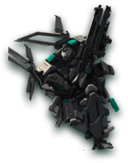

# 🦾 Mecha

The mech is a mimic combat aircraft. It also has attributes such as mining power, combat power, defense power, durability, and storage space. Compared with the spacecraft, it has higher combat power and defense power, but due to its smaller size, it has durability, Storage space and mining power will be lower, and his attributes directly determine its mining efficiency and the outcome of each battle.

Each time you perform a task, the mecha will consume durability. When the durability is lower than 20%, the mecha will be forced to return to the base to enter the repair state. You can choose to repair it automatically or use spar to speed up the repair.

Different mechas have different weapon spaces and armor spaces. You can buy weapons to increase the combat effectiveness of your mecha or purchase armor to increase the defense of your spacecraft.

## Ship class

The spacecraft is divided into five levels according to different body types and uses.

FREIGHTER BATTLESHIPFRIGATE

&#x20;.png>)BATTLECRUISER SUPERCARRIER


**Good to know:** you can embed public links, like this Typeform, to make data capture a breeze!



