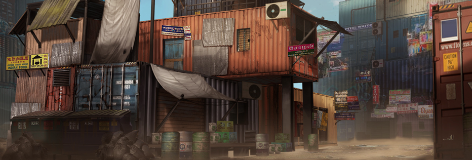

# 🪨 Land

If you capture a planet, then this planet will become your territory. On the planet, you can build fortifications to increase its attack and defense power and protect your planet. On it, you can replenish your own. Spaceships, or collection of resources, can charge other players who come, or refuse other players to come. You can even allow only designated players to come.

At the same time, the occupied planets can be transformed and developed. Different planets will have different plots. You need to consume ETR to transform the ecology to activate the plots on the planet for the construction of different buildings. After construction, the plots will generate one NFT belongs to the builder. Both the territory and the stars can be traded freely. You can also charge other players for coming, or you can refuse other players to come, or even you can only allow designated players to come.
